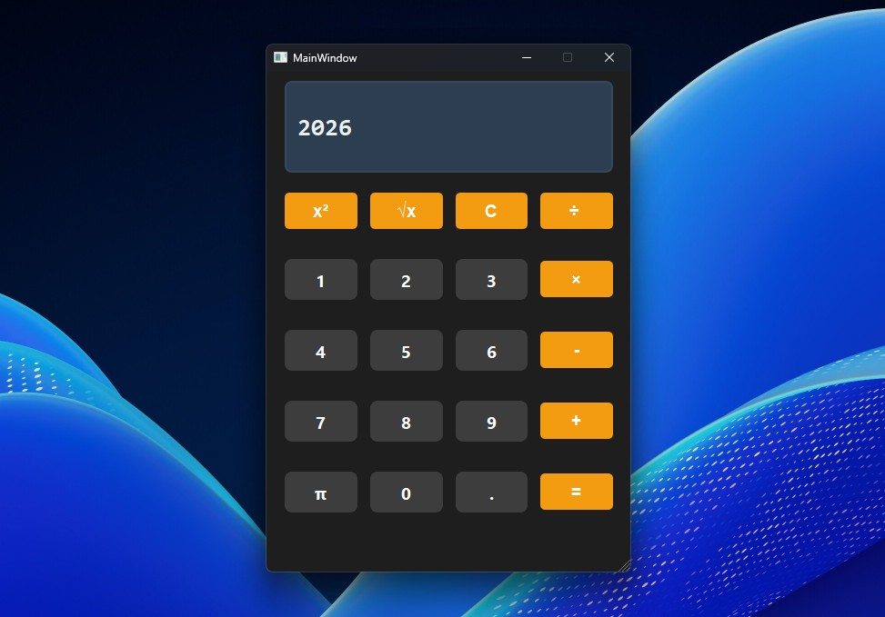

# Qt6 Calculator



## 📝 Description
A simple, fast, and optimized desktop calculator built with **C++** and **Qt6 framework**. This project demonstrates a clean dark-themed UI with essential mathematical operations and a responsive layout.

## 📥 Download (Ready to Run)
You don't need to compile the code to use the app! You can download the latest portable version for Windows from the link below:
👉 **[Download Latest Release](https://github.com/EHSBIZ/Qt6-Calculator/releases/latest)**

## ✨ Features
- **Basic Operations:** Support for addition, subtraction, multiplication, and division.
- **Advanced Functions:** Includes square ($x^2$), square root ($\sqrt{x}$), and Pi ($\pi$) constants.
- **Modern UI:** Sleek dark mode design with a consistent orange-and-grey color palette.
- **Optimized Performance:** Built using C++ for high efficiency.

## 🛠️ Technologies Used
- **C++**
- **Qt6 Framework**
- **CMake**

## 🚀 How to Run (For Developers)
1. Ensure you have **Qt6** and a **C++ compiler** installed.
2. Clone the repository:
   ```bash
   git clone [https://github.com/EHSBIZ/Qt6-Calculator.git](https://github.com/EHSBIZ/Qt6-Calculator.git)
